# 幸运儿 행운아

[TOC]

## **圣遗物套装效果**

### 两件套效果

防御力提高100点。
방어력 +100pt

### 四件套效果

拾取摩拉时，恢复300点生命值。
모라 획득 시 HP를 300pt 회복한다

## 圣遗物故事

### 1. 幸运儿绿花 행운아의 네잎 클로버

<u>**无忧无虑地生长在原野里的四叶绿花，被采是因为能带来幸运之说。**</u> 
<u>**들판에서 걱정 없이 자라는 네 잎 클로버. 꺾인 건 행운이 가져다 온다는 설이 있기 때문이다**</u>

生来幸运的孩子，无论何种奇迹都会向他敞开怀抱。
기적은 언제나 행운을 타고난 아이에게 품을 활짝 열게 되어있다.

那是传说中的绿色四叶花，是承载幸运的宝贵赠礼。
전설 속의 4개 잎이 달린 <u>클로버</u>는 행운의 뜻을 담은 귀중한 선물이다.

无忧的幸运儿在原野上游荡玩耍，无意间发现了它。
행운아는 들판에서 뛰어놀다 무심코 그것을 발견하게 된다.

出于童稚的顽皮，幸运儿采摘下绿花，装进了自己的口袋。
어린아이의 유치한 동심 때문이었는지 그는 클로버를 따서 자신의 주머니 속에 넣어두게 된다.

不知是幸运的绿花带来了好运，还是好运引导他遇见了它。
행운의 상징인 클로버가 그에게 행운을 가져다주었는지 아니면 행운이 그를 인도해 클로버를 만나게 했는지는 아무도 모른다.

### 2. 幸运儿鹰羽 행운아의 독수리깃

**<u>挡在面前的魔物却被捕食的鹰隼盯上，偶尔能带来这种程度运气的翎羽。</u>** 
**<u>앞을 가로막는 마물이 오히려 사냥감을 찾는 매의 눈에 포착되는 정도의 운을 가져다주는 깃털</u>**

生来幸运的孩子，即使阻挡路途的恶兽也只好在他面前乖乖让路。
행운을 타고난 아이는 길을 막는 악한 짐승이라도 순순히 길을 양보하게 만든다.

无忧的幸运儿在森林中漫步，殊不知虎视眈眈的魔物正躲在暗处。
행운아는 아무런 걱정 없이 숲속을 거닐고 있었다. 그를 호시탐탐 노리는 마물이 어둠 속에 숨어 있는지도 모르고 있었다.

正当男孩被鲜艳的毒菇吸引，魔物一跃而出蹋扁了那剧毒的蕈菌。
소년은 선명한 색의 독버섯에 끌려갔는데 마물이 갑자기 튀어나와 독성이 강한 버섯을 한 방에 밟아버렸다.

魔物以为便宜的餐食送上门来，却没注意一枚鹰羽刚刚落在肩头。
마물은 <u>꽁으로</u> 음식을 얻었다는 생각에 어깨에 떨어진 <u>매</u>의 깃을 주의하지 못했다.

### 3. 幸运儿沙漏 행운아의 모래시계

**<u>因为破洞而空空如也的沙漏。时光流逝对无忧无虑的人没有意义。</u>** 
**<u>구멍이 뚫려 텅 빈 모래시계. 흐르는 시간은 아무런 걱정이 없는 사람에게 의미가 없다</u>**

生来幸运的孩子，就算永流的时光也不会让他变老。
태어날 때부터 운이 좋은 아이는 흐르는 시간 속에서도 늙지 않는다.

待年岁已衰，幸运儿既没有家庭，也没有子孙绕膝。
<u>연세</u>가 든 행운아는 <u>가정</u>을 이루지 못하였고 자손도 없었다.

但在好运的一生中，人人都是他的交心好友与家人。
그의 행운스러운 일생에서 만나는 사람마다 그의 친구가 되었고 <u>가족</u>이 되었다.

即使是在他生命将尽之时偶然间看见倒计时的沙漏。
설령 그가 생명의 끝을 달리고 있을 때 거꾸로 놓인 모래시계가 눈에 들어와도

他也只是哈哈大笑，拿起弹弓，只一发就把它打破。
그는 그저 허허 웃으며 새총으로 모래시계를 한 방에 깨부술 뿐이었다.

### 4. 幸运儿之杯 행운아의 잔

<u>**精致的金属器皿，曾经被用来打趴了夜盗。**</u> 
<u>**정교한 금속 그릇. 밤에 찾아오는 도둑을 때려눕히는 데 사용되기도 했다**</u>

生来好运的孩子，就算心怀歹意的盗匪也无法伤他半分。
악의를 품은 도적도 행운을 타고난 아이에게 상처를 낼 수 없었다.

那是幸运儿长大后的故事，就发生在一家酒馆后的小巷。
이건 한 <u>술집</u> 뒤의 골목에서 일어난 일로 행운아가 어른이 된 후의 이야기이다.

当时夜黑无月，凶恶的盗贼正准备对酣醉的幸运儿动手——
어두컴컴한 밤에 흉악한 도적들은 만취한 행운아에게 손을 대려고 하였는데——

却被不知何处飞出的酒杯砸中了脑袋，扑通一声到地不省人事。
어디에서 날아온 술잔에 머리를 맞아 쿵 하고 쓰러져 인사불성이 되고 말았다.

或许这得归功于酒馆楼上那场斗殴，但并非人人都有如此运气。
술집 위층에서 벌어진 싸움 덕분이라고도 말할 수 있지만 누구나 이런 운을 갖고 있는 건 아니다.

### 5. 幸运儿银冠 행운아의 은관

<u>**原本坠入落穴，却是被驱逐的旧宗族藏宝的地窖。是那次经历的纪念品。**</u>
<u>**우연히 떨어진 구멍이 추방된 옛 종족의 보물이 숨겨진 땅굴이었다. 그때에 얻은 기념품이다**</u>

生来幸运的孩子，即使凶险的陷阱也为他准备着意想不到的宝藏。
행운을 타고난 아이는 아무리 험한 함정에 빠져도 예상치 못한 보물을 얻을 수 있다.

无忧的幸运儿在遗迹间流连，却不想一时失足，落入深深的地穴。
행운아는 아무런 걱정 없이 유적 사이를 떠돌다가 발을 헛디디는 바람에 깊은 땅굴로 떨어지게 된다.

男孩掉落在灰烬堆上安然无恙，原来那是腐烂成灰的天鹅绒床垫。
소년은 잿더미 위에 떨어져 무사했는데 자세히 보니 먼지가 가득 쌓인 벨벳 매트리스였다.

就这样，幸运儿发现了旧日宗族的秘宝，把好运冠冕加在额头上。
이렇게, 행운아는 옛 종족의 <u>비보</u>를 발견하여 행운의 <u>관면</u>을 이마에 얹게 되었다.

## **学习笔记**

### 小知识

#### 1. 클로버&토끼풀 三叶草与四叶草？

当我们用**클로버**搜索时，总会蹦出**토끼풀**这个词语，平时日常生活中，这两个词语也经常会混用，但**클로버**和**토끼풀**并不完全等同。

首先，三叶草，英文clover，韩语**클로버**，泛指所有三篇叶子的草本植物。而四叶草是三叶草的变异种，在韩语中，四叶草叫做**네잎 클로버**（四片叶子的三叶草），为了区分，也会把三叶草叫做**세잎 클로버**（三篇叶子的三叶草）。平日里用**클로버**就能应付大部分的场合了。

不过要细分的话，三叶草主要指三种植物：车轴草属，苜蓿属和酢浆草属。而这三种植物在韩语里都有很有趣的名字。

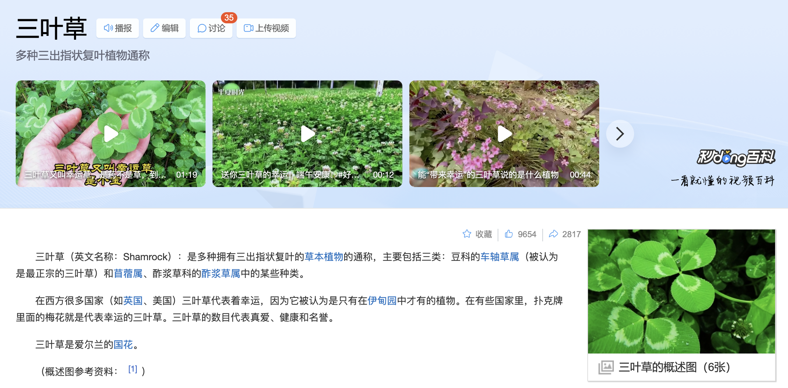

**토끼풀**，直译过来就是兔子草，在学术上对应的是**车轴草属**Trifolium，拉丁文原意就是三片叶子，可以说是最正统的“三叶草”，外观一般如下图。韩语里兔子草这个名字的来源有两种说法，一种是说因为这种植物兔子爱吃，另一种说法是这种植物的花朵看起来像兔子的尾巴。

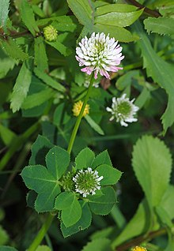

整个朝鲜半岛以及东亚大陆上原本并不生长这种植物，属于归化植物(귀화식물) 。据资料显示，1907年，位于京畿道水原的劝业模范场(권업모범장/勸業模範場)将这种植物引入作为饲料使用，随后这种植物开始在朝鲜半岛扩散。而因为它们会沿着铁路蔓延，也有了“铁道草”(철도풀)这个名字。

**개자리**，直译过来是狗坐垫儿，学术上对应对应**苜蓿属**Medicago，因为狗狗喜欢躺窝在这种植物生长的地方，因而有了这个名字。苜蓿属植物外形如下。

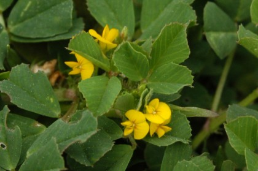

**괭이밥**，直译过来是猫饭，在学术上对应的是**酢浆草属**Oxalis，因为传说猫(고양이/괭이)在消化不好或者掉毛的时候可以吃这种植物来治疗，从而有了这个韩语名字。

酢浆草是目前最接近大众认知的、有着爱心叶片的“三叶草”。平时我们使用的emoji里的三叶草和四叶草，原型也是酢浆草。

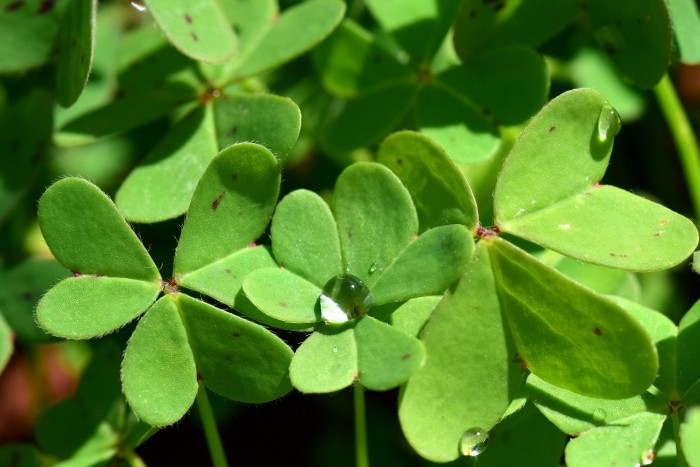

#### 2. 독수리&매 鹰？隼？枭？迪卢克？

当我们在词典里查鹰对应的韩语时，会蹦出来好多种表达，其中比较常用的就有수리和매这两种叫法。但수리和매也是有差别的。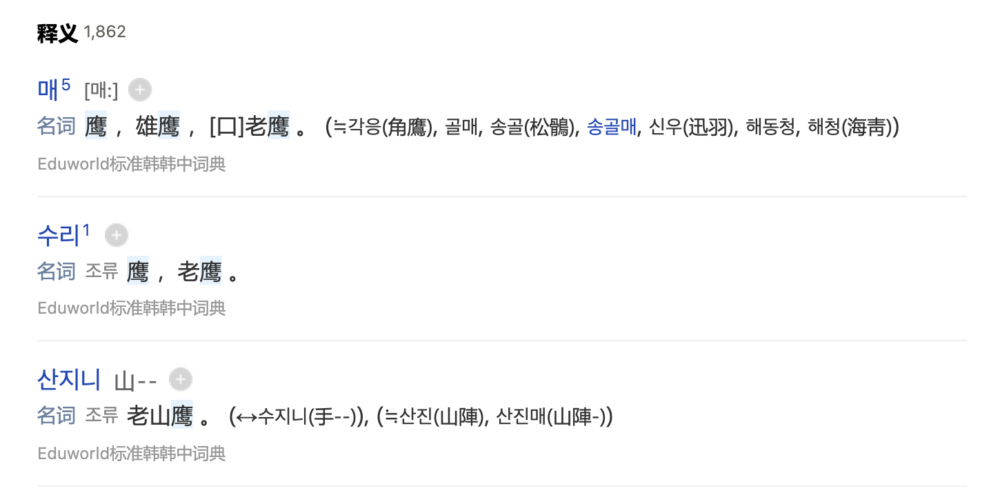

**매**，日常生活中指代所有的猛禽类，鹰雕隼鸢鹫枭，统统都可以用매来称呼。

过去，我国元代鹰猎习俗影响到了高丽，元朝常派捉鹰使到高丽，而高丽产生了**鹰坊(응방/鷹坊)**，并派出鹰坊使，随捉鹰使去往各地捕捉猛禽。也是从那时起，高丽开始了对猛禽的捕捉和饲育，并衍生出了对猛禽类的各种细分称呼，比如说来自于蒙古语的**보라매**，指的是在未满周岁时被捕获并养大的鹰，보라在蒙古语里是бор(bor)，代表褐色；**날지니**是野鹰；**수지니**是人类从幼鸟开始养大的鹰；**초(初)지니**是养到两岁的鹰；**재(再)지니**是养到三岁的鹰；在上图中可以看到，现在还用**산지니**来代表老山鹰。

但是到了现代，鹰和其他猛禽的称谓似乎根据学术分类有了一些变化。

**매**，严格意义上来说，根据对应的拉丁语学名，现代的可以指代的是整个隼形目Falconiformes，属于小型猛禽，和鹦鹉更亲。

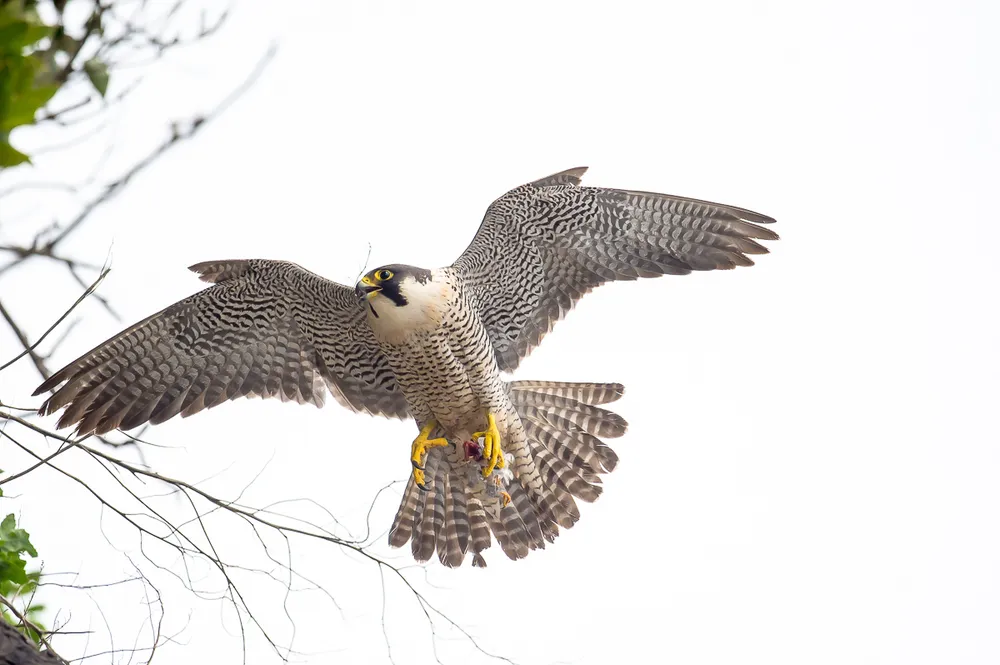

**수리**，严格意义上指的是雕，有时候也会用英语发音的**이글**来表达，属于鹰型目Accipitriformes。美国国鸟白头海雕흰머리수리就属于수리这一类。

原神中的生物鹰类，茶羽鹰**차색깃 매**，棕翎鹰**갈색깃 매**，白练鹰**백련매**，虽然外形更接近雕类，但还是统称为了鹰，韩语也随中文使用了**매**这个表述。

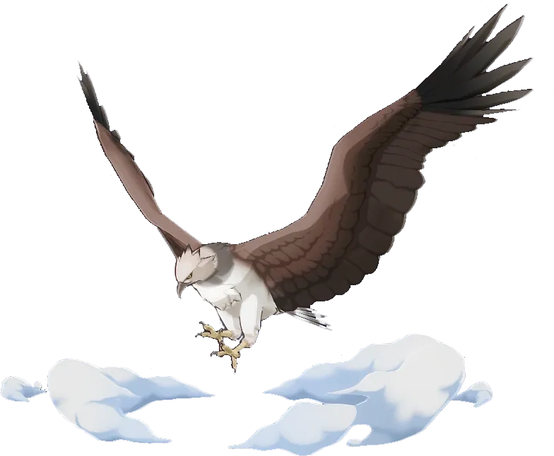

**솔개**，鸢，日常中也泛指隼形目下属的所有肉食类猛禽。游戏中的石鸢，韩语名字就是**바위 솔개**。

但仔细看造型，虽然名字换了一个物种，但也只是茶羽鹰棕翎鹰白练鹰的换皮设计罢了（？）

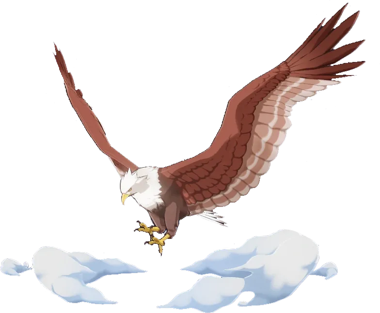

**독수리**，指的是秃鹫，属于鹰型目鹰科秃鹫属。	

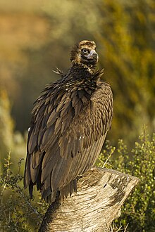

原神里活跃在须弥沙漠地区的赤鹫，韩语名字是**붉은 독수리**。

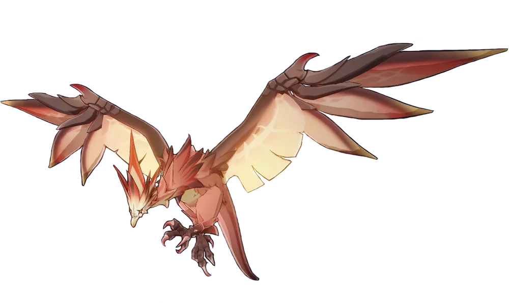

**올빼미**，指鸮形目Strigiformes。在上一期里讲过올빼미和부엉이的区别，这里就不赘述了。

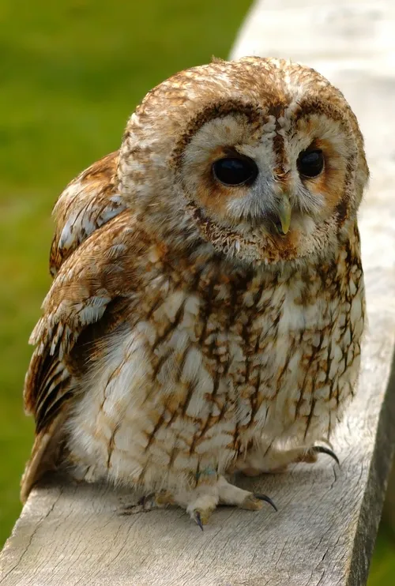

这里要提到的一点，暗夜英雄迪卢克，和鹰类紧密相关，但游戏里似乎并没有细说是哪一种，毕竟……

他的命之座为夜枭座，韩语名为**밤올빼미자리**

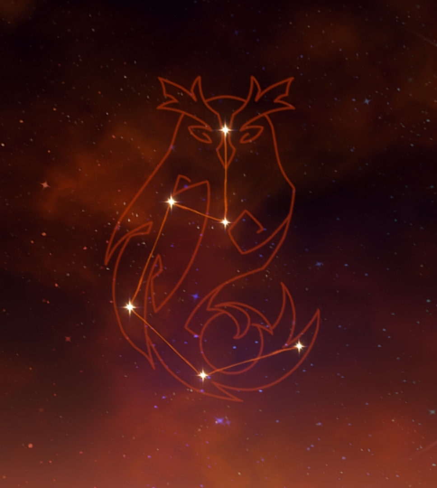

他的待机动作里手臂上的鸟应该是棕翎鹰**갈색깃 매**

大招放出的应该也是鹰类，不过描述里只说的是火鸟**불새**

#### 3. 꽁&공짜 怎么说免费

在文案里面，用꽁으로 음식을 얻었다来表示吃白食和捡便宜。直接去查꽁这个字，并没有免费的意思，谷歌查꽁으로，也有人问这到底是不是标准用法。

但是꽁으로可以表达免费是没问题的，是一个很常用的说法，有说法说꽁으로是공짜로的变体。在更正式的书面语里，似乎用공짜로来表示免费获得还是更稳妥一些。如果有了解这个用法的朋友也欢迎讨论！

#### 4. 연세 怎么用韩语表达年龄？

大家都知道韩语里敬语和平语差别很大，说话讲究一个“看人下菜”。

描述高龄长辈的年龄时，使用**춘추(春秋)**，例如：춘추가 어떻게 되십니까?/춘추가 팔십이십니다. 描述年龄大小时，用高低높다/낮다来表达。

对需要尊敬的长辈上司，使用**연세(年歲)**询问即可，例如：연세가 어떻게 되십니까? 描述年龄大小时，用高低높다/낮다来表达。

而对平辈和后辈，用**나이**就可以了，例如：나이가 어떻게 되세요? 描述年龄大小时，用多少많다/적다来表达。

当然，在日常生活里，涉及到限制级内容时，我们会看到年龄限制연령 제한，这里用的就是**연령(年齡)**这个词了。

#### 5. 가정&가족, 가족의 달 关于家庭的韩语表达

**가정**家庭，指的是一个家族一起生活的空间，或者是有着血缘关系的人的生活共同体。更偏重于空间。

**가족**家族，主要指以夫妇为中心的父母儿女所组成的团体或其中的成员。更偏重于人。

**가구**家口，更接近于我们“户口”的定义，指的是实际居住和维持生计时的基本单位。由于最近婚姻率下降，在韩国诞生了很多**비혼·1인 가구**，也就是以一个人为单位的单身或未婚家庭。

韩国的5月，被称为**가정의 달**家庭月，因为在韩国，5月有很多和家庭有关的节日。

一起来看看5月份的各种和家庭有关的法定节日吧！

**5月1日 근로자의 날/노동절(劳动节)** 

法定纪念日，这一天也是韩国的法定休日（区别于全国大放假的法定公休日），由于不是公休日，韩国一般是不放假的，也就没有国内的劳动节假期的概念。

**5月5日 어린이날(儿童节)** 

是在韩国儿童作家、少年运动先驱者方定焕的号召下诞生的属于韩国的儿童节。这一天也是韩国的法定公休日，全国沾光跟着小朋友一起放假一天。

**5月8日 어버이날(父母节)**

法定纪念日，最初在韩国只有母亲节，但后来因为考虑到父亲节的缺位，最终在1973年由总统令规定5月8日为父母节并延续至今，这一天不放假，但是韩国人会购买康乃馨或者保养品送给父母。

**5月15日 스승의 날(教师节)**

法定纪念日，以世宗大王诞辰日定下的韩国教师节。以往在这一天学生会给老师送礼，也会有各种活动，但是渐渐的节日变了味儿。2016年金英兰法案颁布之后，韩国教师节的送礼传统也渐渐变得谨慎起来了。

**5月第三个星期一  성년의 날(成人日)**

法定纪念日，部分地方和学校会给19岁和20岁的学生举办传统成年礼（관례冠礼），不放假。

**5月21日 부부의 날(夫妇日)**

法定纪念日，由民间团体呼吁，并在2007年正式成为法定纪念日，当然不放假。

#### 6. 술집 提瓦特大陆，去哪里喝酒？

喝酒的地方，在韩语里统称술집。但怎样才能在正确的地方喝到正确的酒呢？

想要喝啤酒，找**호프/탭하우스/펍**

想要喝鸡尾酒和红酒，找**바**（比如红酒吧와인바）

想要喝韩国酒（米酒烧酒等等），找**포장마차(포차)/주점/대폿집**

想要喝日本酒，找**이자카야**(居酒屋)

现在很多店里都混着卖了，其实也不用分得那么细。

当然还有一个快速的方法，那就是直接搜索酒名**(맥주/소주/막걸리/칵테일/와인...)+맛집**或者**地名+술집**。

接下来看看原神里的酒馆韩语名是什么

>  蒙德

享受美酒的蒙德，当然是有好几个能喝到酒的好地方。

**天使的馈赠 천사의 몫(Angel's Share)**

蒙德事故多发地&吃瓜天堂（？）

**晨曦酒庄 다운 와이너리(Dawn Winery)**

比起喝酒，其实是酿酒和交易的地方。

**猫尾酒馆 캣테일 술집(Cattail Pub)**

现在谁在猫尾酒馆喝酒啊，都是去打牌的吧？

> 璃月

众所周知（？）咱们中国人喝酒一般都要配饭，璃月港里也都是以餐馆和高档酒家为主，很少有单纯的酒馆，关于饭店的整理，就以后再说吧。璃月港倒是有喝茶的地方：

**和裕茶馆 화유다관**

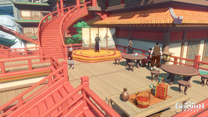

**岩上茶室 암상 차집**

（完全不是正经喝茶的地方吧喂！）

另外，轻策庄的凯叔和石门的老周叔都有开小茶馆，卖大碗茶(대왕차)，不过这两个茶馆好像都没有自己的名字。

> 稻妻

**木漏茶室 코모레 찻집(木漏茶屋【こもれぢゃや】)**

稻妻也主要以餐厅和小食店为主，在稻妻城内有一家木漏茶室。但说到底这里也不是个单纯的茶室，是吧托马？

> 须弥

**兰巴德酒馆 람바드 술집 (حانة لامباد / Lambad's Tavern)**

首先是咱们和须弥的大家尝尝聚会的据点兰巴德酒馆。

这里的tavern更接近酒吧和餐厅的复合体。是在喝酒的同时贩售烤肉奶酪类食物的地方。

**迪亚法饭店 디아파르 식당(حانة جعفر / Djafar Tavern)**

同样，咱们和艾尔海森见面的地方也是一家tavern。

同样是tavernحانة，但韩语和中文里对应了不同的叫法，也算是个有趣的发现。

> 枫丹

枫丹目前开放的地区里还没有酒吧类的商铺，林尼传说任务里琳妮特狂炫甜品的地方是露泽咖啡厅。

不过在以欧洲为原型的地方怎么会缺少喝酒的地方，一起等待后续的更新吧。

#### 7. 잿더미 灰烬

灰烬，灰垛，废墟

平时可以用 잿더미가 되다/잿더미로 변하다 表示化为废墟

例如：

온갖 생각이 모두 잿더미가 되다 万念俱灰

소방차가 도착했을 때는 이미 공장이 잿더미가 된 후였다. 消防车赶到的时候，工厂已经成为了废墟。

流浪者的角色PV《灰烬》，韩语名字就是잿더미

而原神中的烬寂海，韩语名是잿더미의 바다

#### 8. 비보 悲报？还是秘宝？

在文案中，비보指的是秘宝，韩国艺人宋恩伊创立的融媒体制作公司也叫비보vivo，名字来源正是她主持的一档播客节目“宋恩伊和金淑的秘密宝藏”。

不过平日里这个词被用来指代“悲报”，对应汉字**悲報**。

由索尼音乐、环球音乐、谷歌和阿布扎比传媒等公司联合的MCN兼流媒体平台VEVO，韩语名字也是비보。经常刷油管的朋友应该有看过这个标志。迪士尼音乐官方频道也是VEVO管理的。

当然，它也是咱们国产品牌VIVO的韩语名字。

所以记得结合语境看清楚是哪个비보哦。

#### 9. 관면 冠冕？还是宗教上的婚姻宽免？

在游戏文案中，관면指的是冠冕。但这个词语在日常中，更多指的是宗教里的宽免婚姻(관면혼인)。天主教原则上只有信徒之间才可以结为夫妇，但当一位已经受洗的信徒要与一位未受洗的非信徒结为夫妻时，需要得到当地教会的准许，取得“信仰不同”婚姻无效限制的特别宽免，才可以成婚。

当然这个词也对应汉字“慣面”，指熟面孔，熟人。

### 其他词汇

**들판** 名词 | 田野，原野，平原

**걱정 없이** 副词 | 无忧无虑地，放心地

**타고나다** 及物动词 | 先天的，与生俱来的

**사냥감** 名词 | 猎物

**호시탐탐[虎視耽耽]** 名词 | 虎视眈眈

**노리다** 他动词 | 紧盯，伺机，觊觎

**설령[設令]** 副词 | 就算，哪怕，即使，纵然

**새총[-銃]** 名词 | 鸟枪，弹弓

**깨부수다** 及物动词 | 打破，打碎，破坏（思想）

**정교하다[精巧--]** 形容词 | 精巧，精妙 정교롭다

​	***정교** 名词 | 正教，东正教（对应사교邪教，사이비교似而非教）*

**흉악하다[凶惡--]** 形容词 | 凶恶的，歹毒的

**손을 대다** 把手放在……上，着手，动手

**인사불성[人事不省]** 名词 | 不省人事，不近人情

**추방하다[追放--]** 及物动词 | 驱逐，革出

**종족[宗族、種族]** 名词 | 宗族；种族，物种

**땅굴[-窟]** 名词 | 洞窟，地窖，隧道

**벨벳[velvet]** 名词 | 天鹅绒 

**매트리스[mattress]** 名词 | 床垫

**얹다** 及物动词 | 搁，放，张弓搭箭

