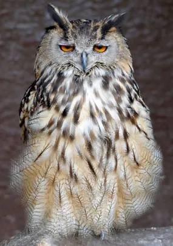
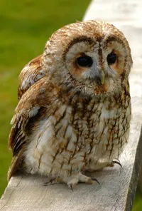
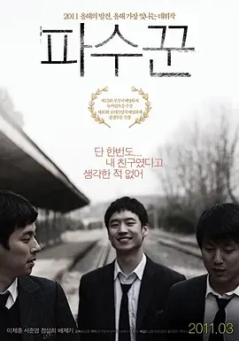

# 游医 떠돌이 의사

[TOC]

## **圣遗物套装效果**

### 两件套效果

角色受到的治疗效果提高20%。
 캐릭터가 받는 치유 효과+20%

### 四件套效果

施放元素爆发时，恢复20%生命值。 
원소폭발 발동 시 HP를 20% 회복한다

## **圣遗物故事**

### 1. 游医的银莲 떠돌이 의사의 은련

<u>**是珍贵的药材，但存放了这么久已经失去了药用价值。**</u> 
<u>**진귀한 약재. 하지만 시간이 너무 오래 지나 약용 가치가 사라졌다**</u>

漫步大地的游医，以冒险家的热情搜罗着珍稀药材。
대지를 거닐던 <u>떠돌이</u> 모험가 같은 열정으로 진귀한 약재들을 모으기 시작했다.

在险峻的山崖上，湿滑的岩石间，她发现一株银莲。
험준한 절벽의 미끄러운 암석사이에서 그는 <u>은련</u> 한 그루를 발견했다.

到最后，药始终没派上用场，花香却一直鼓舞着她。
마지막까지 사용할 기회가 없었지만 은련의 꽃향기는 그에게 큰 힘이 되어주었다.

### 2. 游医的枭羽 떠돌이 의사의 올빼미깃

**枭的坚硬羽毛，夜间行医时用夜行猛禽的意象鼓舞自己。** 
**올빼미의 단단한 깃털. 야간 진료하러 갈 때 야행성 맹금을 떠올리며 자신을 격려한다**

即使在不见五指的深夜，游医也要及时出诊，
그녀는 어두컴컴한 한밤중에도 진찰을 멈출 수가 없었다.

夜幕之中隐藏着无数危险，行人须警醒如枭。
어둠의 장막 아래는 수많은 위험이 도사리고 있어 행인은 <u>올빼미</u>처럼 주위를 경계해야 한다.

如夜枭般无休止的守望，最终使游医病倒了。
밤의 <u>파수꾼</u> 올빼미처럼 쉴 틈 없이 <u>진찰</u>을 다니던 떠돌이 의사는 결국 쓰러졌다.

### 3. 游医的怀钟 떠돌이 의사의 회중시계 

**用来精确计时的道具。对医者而言，即使是一秒的时间也不能浪费。**
**정확한 시간을 재기 위한 도구. 의사한테는 1초도 소중하다**

有时面对性命垂危的伤患，游医不得不争分夺秒。
생명이 위태로운 병자를 만날때면 떠돌이 의사는 항상 <u>촌각을 다퉈야 했다</u>.

怀钟总是分秒不差，助她在拯救伤患于危难之中。
회중시계는 언제나 한 치의 오차도 없이 시간을 알려 그녀가 병자를 구할 수 있도록 도와줬다.

但当晚年的游医独卧病榻，耳边也只有怀钟滴答作响。
하지만 말년에 떠돌이 의사가 병상에 누워 있을 때에도 시계는 계속하여 째깍째깍 소리를 내고 있다.

为脱离危险报时的道具，最终唱出了游医自己的哀歌。
결국 위험에서 벗어나기 위해 시간을 알리던 도구가 그녀의 슬픈 처지를 알리는 도구로 전락하고 만 것이다.

### 4. 游医的药壶 떠돌이 의사의 약주전자

**原本装满了提炼后极浓的药汁，如今只剩下浓烈的药味。** 
**원래는 정제된 약으로 가득 차 있었는데, 지금은 강한 약 냄새만 남아있다.**

浓重的药汤早已干涸，苦涩的气味却无法散去。
진한 탕약은 마른지 오래지만 탕약의 쓴 냄새는 오랫동안 가셔지지 않았다.

游医曾用这陶壶中极苦的汤汁拯救了许多病患。
떠돌이 의사는 약 <u>주전자</u>에 담긴 쓴 탕약으로 수많은 환자들을 살려냈다.

当她身患痼疾时，却只有炉灶上药壶为她叹息。
몸 져 누워 있을 때 그녀를 위해 탄식하는 건 오직 부뚜막에 있는 약주전자 뿐이다.

### 5. 游医的方巾 떠돌이 의사의 두건

**平时能在行医时绑住乱发，紧急情况下也能用来托起扭伤、折断的手臂。 
평소에는 <u>진료</u>할 때 헝클어진 머리를 묶을 수 있고, 유사시에는 접질리고 부러진 팔을 받치는 데 사용할 수 있다.**

在那些居无定所的日子里，游医每天都会匆忙出行。
거처 없이 떠돌아다녀도 떠돌이 의사는 매일 <u>진찰</u>을 나선다.

无论是晴日当空，还是大雨瓢泼，都无法阻挡步伐。
티없이 맑은 날이든 폭우가 미친듯이 쏟아지는 날이든 모두 그녀의 발길을 멈출 수 없었다.

不仅保护了她野草般的头发，也用来包扎伤病患者。
그녀의 들풀 같은 머리카락을 보호해줄 뿐만 아니라 병자의 상처를 싸매는데도 쓰였다.

游医的方巾历经风雨，是她漂泊路上最忠诚的伙伴。
이 두건은 그녀의 떠돌이 생활에서 가장 충성스러운 동료였다.

## **学习笔记**

### 小知识

- **떠돌이** 游子，流浪汉

  原神中的角色流浪者的名字”방랑자[放浪者]“和曾用名”부랑자[浮浪者]“也有类似的意思。类似的表达还有“유랑자[流浪者]”“나그네”等等。

  不过떠돌이，방랑자，나그네还是有一些细微的区别的。

  根据韩语释义来看，방랑자和떠돌이指的是정한 곳 없이 이리저리 떠돌아다니는 사람，即没有固定的居所四处流浪的人，而나그네指的是자기 고장을 떠나 다른 곳에 잠시 머물거나 떠도는 사람，更偏向于离开了家乡经过某个地方的游子或是旅人。

  

  

- **은련** 银莲

银莲花这一物种更常用的韩语名，为바람꽃，直译为风之花，据说是因为这种花在风中摇曳起舞的样子非常美丽，于是有了“风之花”这个名字。

在游医圣遗物的文本里，银莲使用了汉字音译，不知道是不是要和蒙德风之花（바람의 꽃）这一特殊概念做出区分？

实际上은련这个表达在韩国会更常被理解为银联。在韩国向商家确认是否可以用银联支付时，可以用은련카드 결제或者유니온페이(Union Pay) 결제来表达哦~

- **올빼미** 猫头鹰，枭

  在韩语里，提到올빼미一般会想到圆头圆脑的猫头鹰，也可以用부엉이来称呼，对应的英语都是Owl。

  不过这里还是有一些细微差异的。韩国有一个民间说法，有尖尖的耳羽，脑袋长得像ㅂ的是부엉이。

  

  看不见耳羽脑袋圆滚滚的就是올빼미。

  

  当然这个区分方法没有什么科学依据，但日常要简单区分有没有耳羽的枭们还是OK的。

  而빼미这个词在二次元世界里也很常见。

  宝可梦里的木木枭，韩语名字叫做나무빼미，即树(나무)+枭(빼미)。

  

  游戏《崩坏：星穹铁道》的走近星穹节目主持人叽米，韩语名字也是빼미。

  

  

- **파수꾼[把守꾼]** 守卫，看守

  韩语里，一般用“-꾼”来表达做体力活动的人。

  例如：나무+꾼=나무꾼，指的是樵夫；짐+꾼=짐꾼，指的是脚夫。

  不过单独一个파수也可以作为名词“守卫”使用。

  韩国影视剧里有两部叫做파수꾼的作品。

  一个是2011年上映的电影《守望者》（也有译名《韩夜》，《青春夜行》）。

  

  另外一个是2017年开播的电视剧《守望者》。

  

- **촌각[寸刻]** 寸刻

  文案里用到的表达是촌각을 다투다，意为分秒必争，类似的用法还有촌각을 지체할 수 없다，是一个在突发事故或者医疗相关的报道里比较常用的表达。

  与촌각[寸刻]类似的汉字词还有구각(晷刻)，촌구(寸晷)，촌시(寸時)，촌음(寸陰)，촌초(寸秒)，탄지(彈指)，탄지경(彈指頃)等等。

  

- **주전자[酒煎子]** 酒壶，水壶

  손잡이와 꼭지가 달려 있으며, 물을 끓이거나 잔에 따르는 데 쓰는 그릇.

  一般指有把手和盖子的壶。

  游戏中尘歌壶也属于这一类，尘歌壶用韩语表达是속세의 주전자。

  

  

- **진찰[診察]** 侦察

  关于在医院看病有几种表达，진찰[診察]，진료[診療]，검사[檢査]，치료[治療]，看上去差不多但还是有差异的，看汉字大家应该也能区分了。

  按照就医顺序来整理的话就是：

  - 진찰[診察]

    의사가 여러 가지 방법으로 환자의 병이나 증상을 살핌.

    医生使用各种方法来探查患者的病症。

  - 검사[檢査]

    어떤 일이나 사실의 옳고 그름이나 사물의 좋고 나쁨 등을 살피거나 조사함

    调查某件事情正确与否，或者状态好坏。

  - 치료[治療]

    병이나 상처 따위를 잘 다스려 낫게 함.

    让患者的病或者患处好转恢复。

  - 진료[診療]

    의사가 환자를 진찰하고 치료하는 일.

    医生对患者进行诊察和治疗的全过程。

### 其他词汇

**약재 [藥材]** 名词 | 药材，制药原料

**약용 [藥用]** 名词 | 药用

**거닐다** 动词 | 散步，漫步

**험준하다 [險峻]** 形容词 | 险峻

**암석 [巖石]** 名词 | 岩石

**그루** 依赖名词 | 株，棵；茬 ，季 (一年中播种的次数)

**어두컴컴하다** 形容词 | 黑暗的，昏暗的，伸手不见五指的

**회중시계[懷中時計]** 名词 | 怀表

**쉴 틈 없다** 没空休息，常用表达有쉴 틈 없이 바쁘다等

**말년[末年]** 名词 | 老年，晚年；末期，后期

**병상[病床]/[病狀]** 名词 | 病床，病状

**전락하다[轉落--]** 动词 | 坠落，堕落

**가시다** 动词 | 消失，隐去，退去

**발길을 멈출 수 없다** 无法停下的，无法阻止的

**싸매다** 动词 | 包，裹，常用表达有머리를 싸매다，表示全神贯注或者苦苦思索